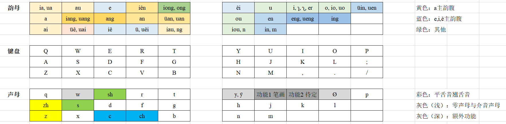

# TSP 双拼

## 介绍

适用于 [RIME 输入法](https://rime.im/) 的双拼方案。

具体双拼方案清查看 `TSP.xlsx`。

对于 Windows 的 RIME 输入法用户，复制 `TSP_shuangpin.dict.yaml` 和 `TSP_shuangpin.schema.yaml` 到 `C:\User\{用户名}\AppData\Roaming\Rime\` 下即可。

其中，字典来自[极光双拼](https://github.com/hosxy/rime-aurora-pinyin)。

## 键位

## 注意

注意，在 y w (ÿ) 开头的内容中，有两种罗马字方案，分别是

- **真开头**：鸭 ya = y + a, 音 yn = y + n，温 wen = w + en，晕 ÿn = ÿ + n；（介音直接形变作开头）
- **伪开头**：鸭 yia = y + ia, 音 yin = y + in，温 wuen = w + uen，晕 ÿün = ÿ + ün。（一个形式字符和一个真介音）

规则：对于 i u ü，真开头方案用 y w ÿ 直接替代三者，伪开头方案在最前面分别加 y w ÿ 的形式字符

**TSP 仅采用伪开头方案**；拼音部分采用真开头方案，部分采用伪开头方案。

| 真开头 | 伪开头(TSP) | 拼音的选择 | 备注 |
| :---: | :---: | :---: | :--- |
| ya   | yia   | 真 | |
| wa   | wua   | 真 | |
| yo   | yio   | 真 | |
| wo   | wuo   | 真 | |
| yê   | yiê   | 真 | |
| ÿê   | ÿüê   | 伪1 | 原因：含有 ü |
| y    | yi    | 伪2 | 原因：独体 |
| w    | wu    | 伪3 | 原因：独体 |
| ÿ    | ÿü    | 伪4 | 原因：含有 ü；独体 |
| wai  | wuai  | 真 | |
| wêi  | wuêi  | 真 | |
| yau  | yiau  | 真 | |
| you  | yiou  | 真 | |
| wan  | wuan  | 真 | |
| ÿan  | ÿüan  | 伪5 | 原因：含有 ü |
| wen  | wuen  | 真 | |
| yên  | yiên  | 真 | |
| yn   | yin   | 伪6 | 原因：介音+n/ng |
| ÿin  | ÿüin  | 伪7 | 原因：含有 ü；介音+n/ng |
| yang | yiang | 真 | |
| wang | wuang | 真 | |
| yong | yiong | 真 | |
| weng | wueng | 真 | |
| yng  | ying  | 伪8 | 原因：介音+n/ng |

（以上均不考虑 ÿ->y、ü->u、ê->e、uêi->ui、uen->un、au->ao、üin->ün 的简省）
